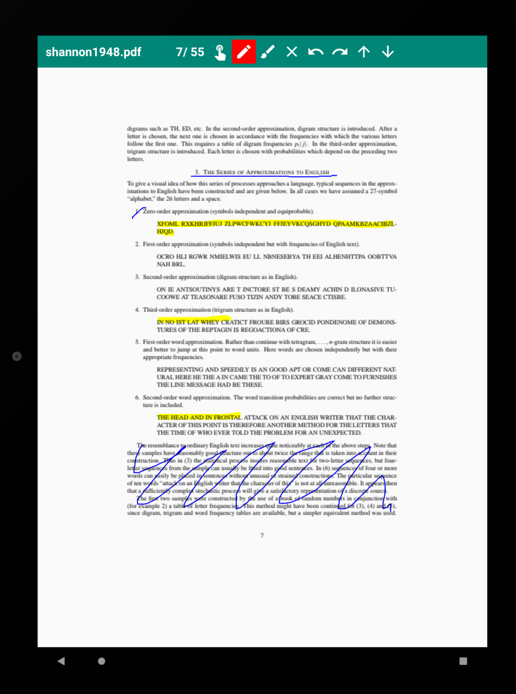

# PDF Editor

PDF Viewer/Editor for Android
- Support for common PDF Editor functions such as drawing, highlighting, etc
- Ability to undo/redo actions

## Technical Information

  Tested on Android 10.0 (Q) API Level 29
  

## Acknowledgments

* [Google Material Design Icons](https://google.github.io/material-design-icons/)

